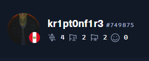

    

#NUEVA aCT

  <h1> Hello I'm kr1pt0n </h1>

<h3> CyberSecurity Junior | Red-Team/Pentester | HTB Player </h3> 
      <h4>My Hack The Box Profile</h4>
  

 

- Learning CyberSecurity (Pentesting) On HTB(HackTheBox) & THM(TryHackMe)

  
  
  
  
  
  
  <!--
  
  -->

### Technologies

<b>🔥 Github Streaks</b>

